# How to install CentOS(8) for the script
English corection will be done...soon. I hope at least.
## What is needed:
+ Stable internet connection.
+ Oracle VM virtualbox. [Oracle download](https://www.oracle.com/cz/virtualization/technologies/vm/downloads/virtualbox-downloads.html)
## Install Iso:
+ Firstly, go to the centos page and install iso (there is rpm option for centos 9, in case i update it for centos 9)  
[CentOS8 ISO download](http://isoredirect.centos.org/centos/8-stream/isos/x86_64/)
+ Simply install the closes mirror (the page will show it)
## Oracle install:
**There are possible wrong configs, or some other errors, if u have any issues, there is maybe better tutorial at the youtube...**
+ firstly, we will neeed to setup-up oracle VM, so simply launch the program and click on the ``NEW`` menu option at the top
+ Than we will need to fill pop-up window as foto bellow shows. 
> the location of folders and ISO is different for you :)  

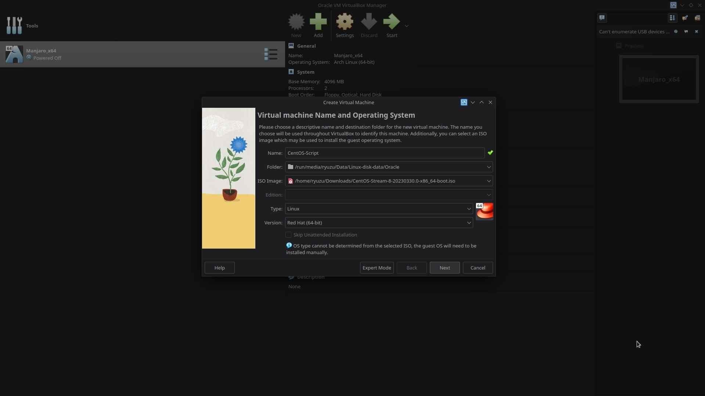
+ You can set up similarly next windows(or whatever you call this) as I did.
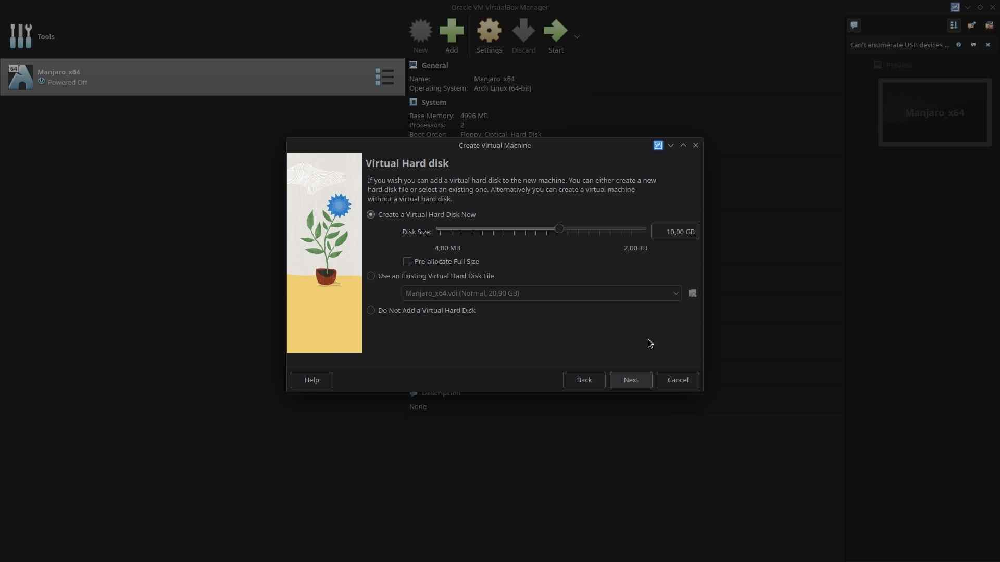
> this step is optional, if the VM doesnt want to load ISO, maybe this will help :)
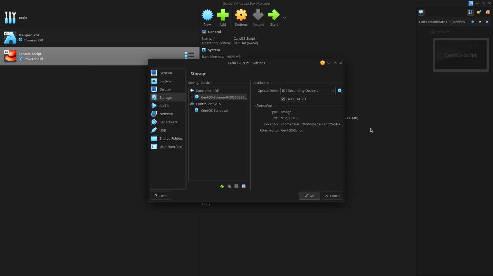

> after this image there should be some sort of overview, check everything and hit ``finish``
+ Now start the VM by clicking ``START`` option at the top.
+ And select ``Install CentOS Stream 8`` .

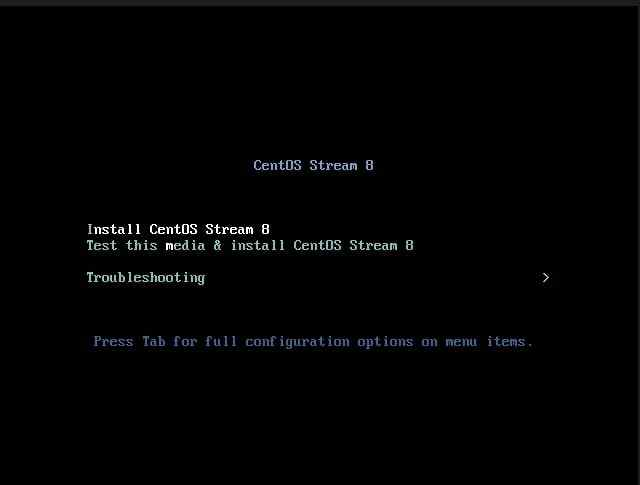
+ You can choose what langauge you want (I recommend staying with English).

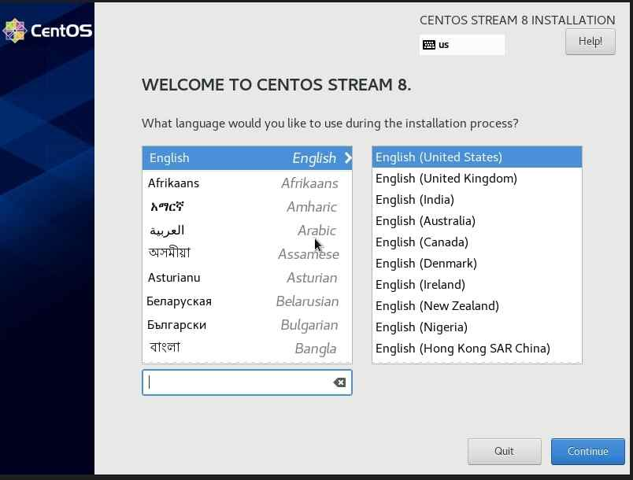
+ As this epic pointer shows, firstly we need to establish internet connection.

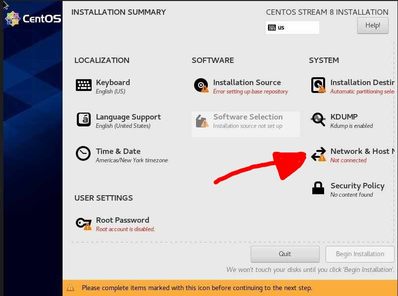
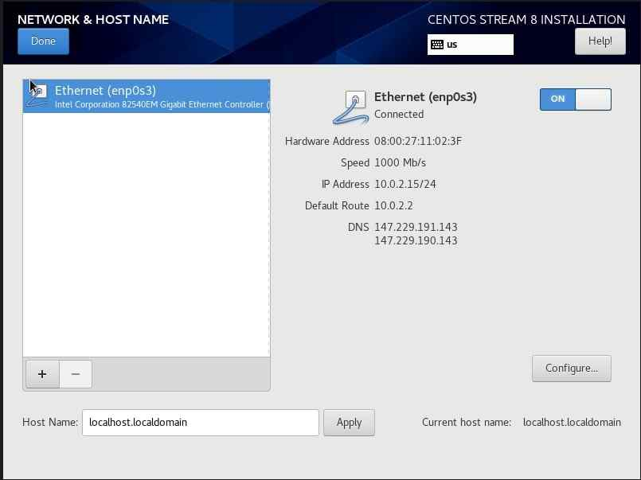
> and click ``Done``

+ Once again, follow this epic red pointer 
> (I am using one screenshot for this menu, as I am too lazy...)

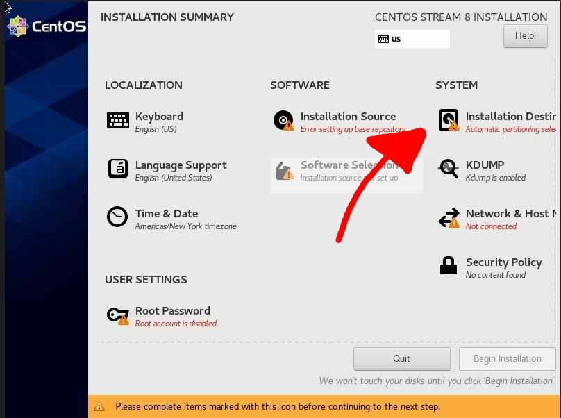
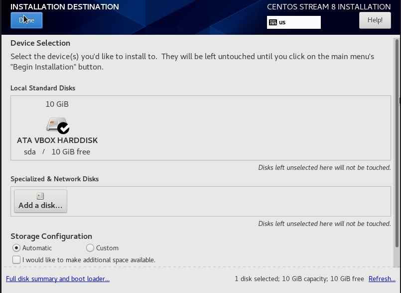

+ Guess what, ANOTHER EPIC RED POINTER!
> there is actaully no need to disable kdupm right now, as the script should do it by itself.But who knows maybe I did forget.

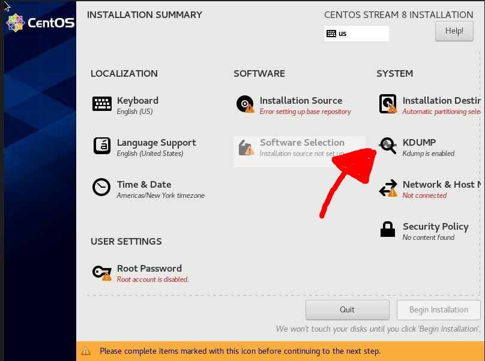
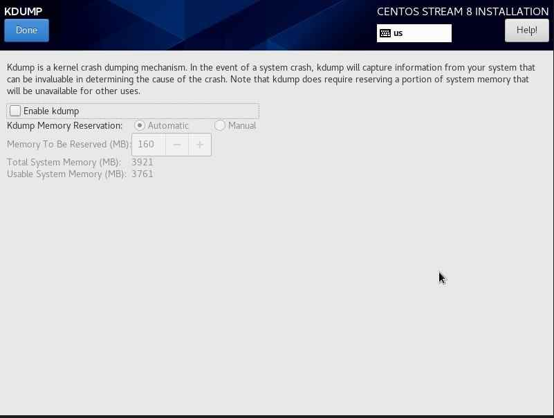

+ Epic red pointer, I know. But now we will select minimal instalation.

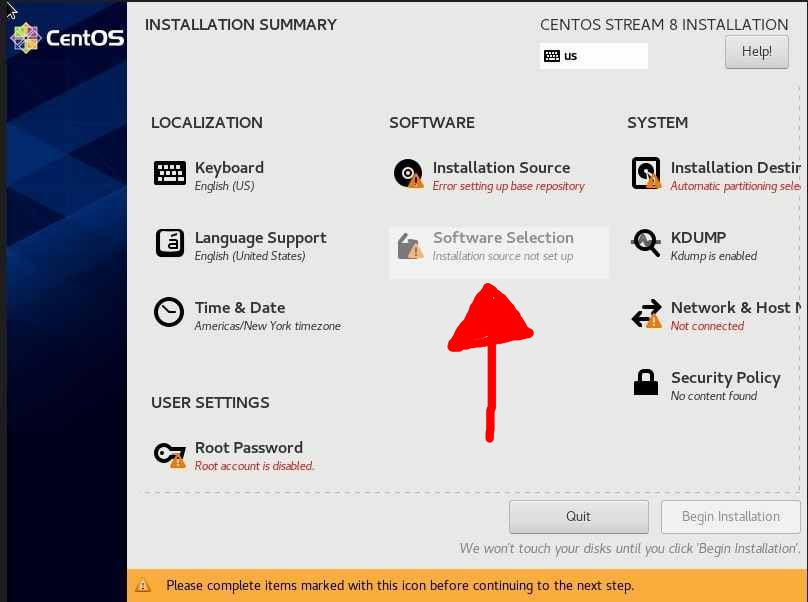
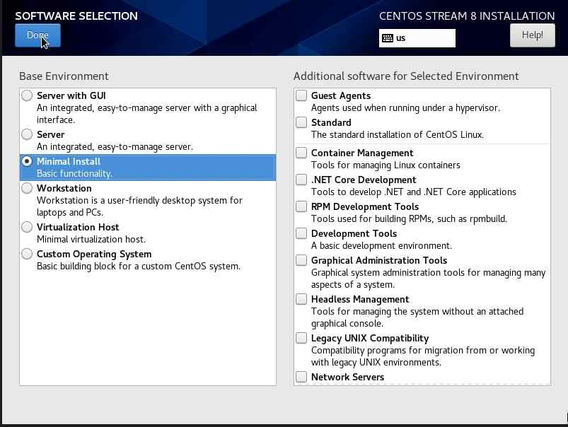

+ And lastly, set up Root password (There is really no need for specific user profiles)
> If u select password as ``admin``, you should hit ``Done`` twice.

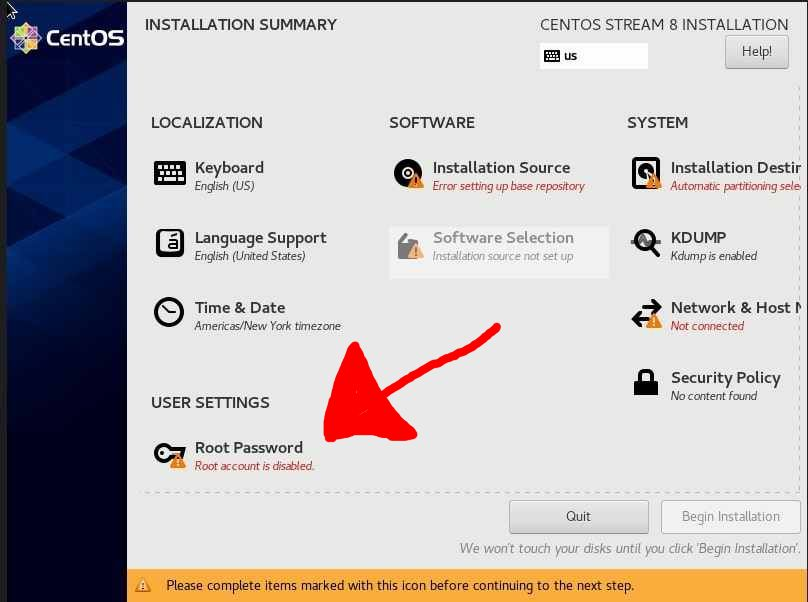

+ and finally ``Begin Installation`` should be fully blue now and ready to install

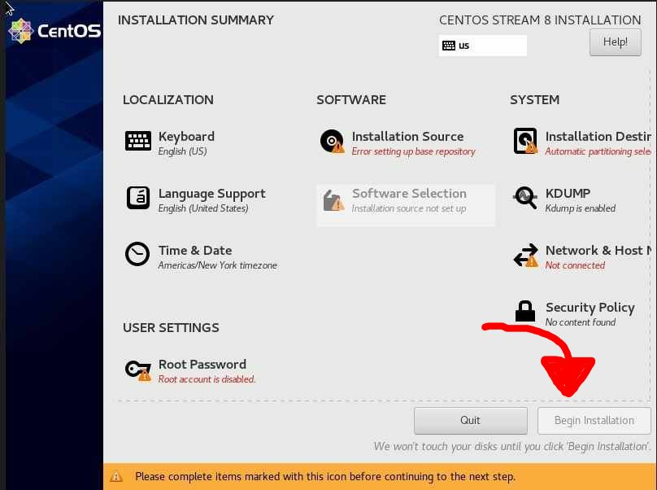

+ After all of this hell. And after the installation is done, hit reboot.
> OS should boot by itself.
> If not, try pressing ``F12`` at the boot and select HDD or something like that.
> If OS is taking forewer to boot, hit ``ESC`` and it will show what is taking so long
+ Finally login with username ``root`` and password that you selected.

